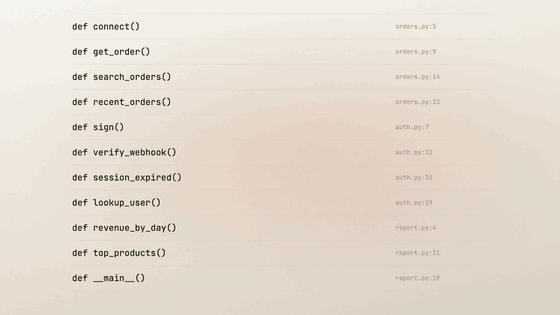
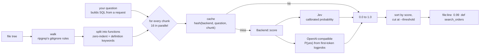
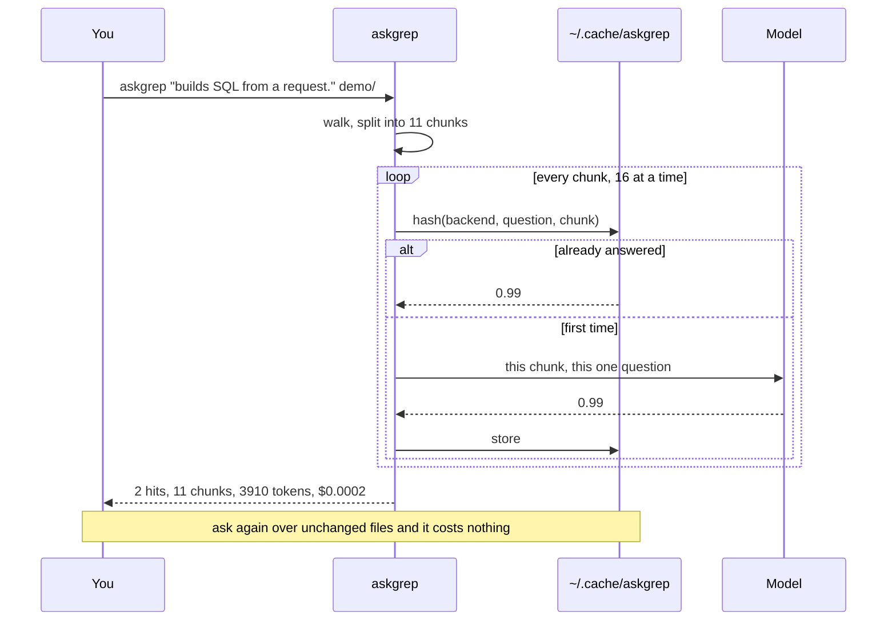

# askgrep

grep for the questions you cannot write as a pattern.

**Powered by [Jev](https://typesafe.ai), TypeSafe AI's System One model.** It
returns a calibrated probability instead of prose, which is what makes reading
every function affordable rather than sampling a few.


```console
$ askgrep "builds an SQL query by concatenating a value that came from the request." demo/
orders.py:14  0.99  def search_orders(conn, request):
report.py:11  0.98  def top_products(conn, request):

2 hits in 11 chunks  |  0 cached  |  3910 tokens  |  $0.0002
```

That is `demo/` in this repo, so you can run the same line and get the same two
hits. The other three queries there bind their parameters and are left alone.

You already know how to find `.unwrap()`. You do not know how to write the regex
for "retries without backoff", so today you guess a few patterns and hope.

## What it gives an agent

Ask a coding agent "which functions build SQL from a request" and it has two
options, both bad. Read the whole tree, or read some of it and guess.

Reading the whole tree is real money. The sweep below is this repository, which
you can price yourself with `askgrep x . --dry-run`: 819 functions, 116,783
input tokens. Output tokens are free on a classifier and are not free on a chat
model.

| reading 819 functions with | input $/Mtok | this sweep |
| --- | --- | --- |
| askgrep | 0.042 | **$0.0049** |
| Claude Haiku 4.5 | 1.00 | $0.12 |
| Claude Sonnet 5 | 2.00 | $0.23 |
| Claude Opus 5 | 5.00 | $0.58 |

A real application is bigger and the gap scales with it, but this row is one
you can check on a tree you already have.

So the agent does the second thing. It greps a few patterns, opens a handful of
files, and answers from those. You get an answer that sounds complete and has
never been checked against most of the codebase.

askgrep turns that into a smaller job. It reads every function for half a cent
on this repository, and hands back a handful of line numbers. The agent then opens nine
functions instead of a thousand, with its context spent on the code that
matters rather than on everything that did not.

```sh
askgrep "builds SQL by concatenating a value from a request" --json src/ \
  | jq -r 'select(.score > 0.9) | "\(.file):\(.line)"'
```

The cheap model narrows, the expensive one acts. askgrep is only the first half,
and it is the half nobody wants to pay frontier prices for.

## It reads everything, not a sample

This is the part that matters. Tools built on an LLM have to sample, because
reading every function costs real money, so they pick a few files by embedding
similarity and answer from those. When the thing you were looking for sits in a
file that did not get picked, the answer is "nothing found" and you never learn
otherwise.

askgrep asks about every chunk. A full sweep of this repository costs half a
cent, so there is no reason to sample. Complete beats probably complete when the
question is a security one.

What that does not tell you is how often it misses. Cost is the easy half.
[docs/evaluation](docs/evaluation) has what has been measured so far, which is
precision and recall on one question with a regex for ground truth, on 120
pinned chunks. That is not a retrieval benchmark and it is not enough. A
recall-first benchmark on a standard dataset is the open work, tracked in
[issue #1](https://github.com/fajarhide/askgrep/issues/1).



Every row above was read and scored. The two that came back hot are the two that
build SQL by concatenation. The [full 28 second
version](https://github.com/fajarhide/askgrep/releases/download/v0.1.0/askgrep-promo.mp4)
is attached to the v0.1.0 release.

## Install

```sh
cargo install --git https://github.com/fajarhide/askgrep
export TYPESAFE_API_KEY=...   # https://typesafe.ai
```

Or take a binary from the [latest release](https://github.com/fajarhide/askgrep/releases):
macOS on Apple silicon or Intel, Linux on musl so it runs on any distro.

`--dry-run` counts the chunks and prices the sweep without a key, so you can see
what a run would cost before signing up for anything.

## Backends

askgrep needs one number per chunk, so anything that can produce one will do.

```sh
askgrep "..."                                      # jev, if TYPESAFE_API_KEY is set
askgrep "..." -b openai -m gpt-4o-mini             # any OpenAI-compatible endpoint
askgrep "..." -b openai --base-url http://localhost:11434/v1 -m qwen2.5-coder
```

**jev** is [Jev by TypeSafe AI](https://typesafe.ai), the default and what every
number on this page was measured with. It returns a calibrated probability
directly, at $0.042 per million input tokens with output free.

**openai** asks a chat model for a single token and reads the distribution over
`yes` and `no` at that position, rather than asking it to rate its own confidence
in prose. That is a distribution the model already computed, and it ranks far
better than a self-reported number. An endpoint that serves no logprobs falls back
to the one word it wrote, and scores are then only 0.0 or 1.0, which makes
`--threshold` meaningless. The footer prints no cost for this backend, because
askgrep does not know what your endpoint charges.

Scores from different backends never share a cache.

## Use

```sh
askgrep "catches an error and swallows it without logging or rethrowing"
askgrep "logs an object that could contain a token or a password" src/
askgrep "still uses the old auth middleware instead of requireSession" --threshold 0.9
askgrep "writes to the database inside a loop" --json | jq -r .file
```

Phrase the question as something the code *does*. Each backend splices it into a
sentence about the chunk, so "builds SQL from user input." reads correctly and
"SQL injection" does not.

Phrasing moves the result as much as anything else in this page. On the same 120
chunks, asking abstractly ("panics instead of returning an error") gave recall
0.07 at the threshold where the literal form ("contains a call to `.unwrap()` or
`.expect(...)`") gave 0.71. The model was not failing to read the code, it was
answering a different question than the one meant. If a sweep comes back empty,
rewrite the question before deciding the tool cannot see it.

| flag | |
| --- | --- |
| `-t, --threshold` | report at or above this score, default `0.8` |
| `-j, --jobs` | concurrent requests, default `16` |
| `--dry-run` | count and price, call nothing |
| `--json` | one object per hit |
| `--no-cache` | re-ask every chunk |

Answers are cached on disk by content. Re-running a question over unchanged files
costs nothing, so the loop of sweep, fix, sweep again is free after the first pass.

## One chunk per request, and why

This is not an argument against batching. TypeSafe measured the opposite case and
published it: many questions about **one shared document** in a single call is 12.2x
cheaper, 10x faster, and changes no answer, because each question is scored on its own
against that document.

askgrep cannot use that shape. Its questions are about different functions, so batching
means packing unrelated chunks into one `state` array and pointing each question at an
index. That is a different thing, and it costs accuracy. Measured on 120 Rust functions,
scored against a regex that answers the same question exactly:

| chunks per request | precision @0.8 | recall @0.5 |
| --- | --- | --- |
| 1 | 1.00 / 1.00 | 1.00 / 1.00 |
| 5 | 0.60 / 0.71 | 0.93 / 0.93 |
| 20 | 0.45 / 0.48 | 0.86 / 0.79 |

Two runs of each, on the same pinned chunks, because one run cannot tell a gap
from noise. Between repeats the scores move 0.012 to 0.036 on average, so the
gap is not noise. An earlier version of this table read 0.85 / 0.65 / 0.43; it
was measured against the live source tree rather than a pinned copy, and the
tree moved.

So askgrep sends one chunk per request and does not offer the alternative. Concurrency
covers the latency instead, which is the thing batching was supposed to buy. Those
120 chunks take 161 seconds one at a time. With the cache cleared between runs and
no 429s at any level:

| jobs | chunks per second |
| --- | --- |
| 8 | 12.6 |
| 16 | 18.7 |
| 32 | 23.7 |
| 64 | 28.7 |

The default is 16, which sits just under the published limit of 1,200 requests a
minute. It was still climbing at 64, so raise `-j` if your account allows it.

That table comes from a question a regex can check exactly, which is what makes it
checkable at all. A semantic question behaves differently, and worse:
[docs/evaluation](docs/evaluation) has both runs, the raw answers, and the reason the
second one's numbers should not be quoted.

## What it is bad at

**It is not a grep replacement.** If you can write the pattern, write the pattern.
ripgrep is instant and free.

**It judges one function alone.** If the validation lives in the caller, askgrep
will call the callee unsafe. That is why hits carry a score and are sorted by it
rather than presented as a verdict. Read them.

**It costs money.** Roughly three cents per thousand functions. `--dry-run` tells
you before you spend.

**English questions work best.** Other languages are handled, but less well.
Measure on your own content before trusting a score.

## How it works



One chunk, one question, one number. Nothing is generated, so the failure mode
is a wrong score, never an invented file or a fabricated line number.

### What one sweep does



## Reproducing the demo

`demo/` holds the three files in the GIF. Two of the five queries in it build SQL
by concatenation and the rest bind parameters, so the sweep has a right answer:

```sh
askgrep "builds an SQL query by concatenating a value that came from the request." demo/
```

`demo.tape` regenerates the GIF with [vhs](https://github.com/charmbracelet/vhs).

## Built on

[Jev](https://typesafe.ai) by TypeSafe AI, a System One model that answers a
yes/no question with a calibrated probability rather than text. askgrep exists
because that answer costs $0.042 per million input tokens with output free, and
at that price there is no reason to read only some of the code.

## License

Apache-2.0
