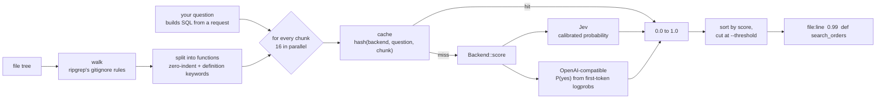
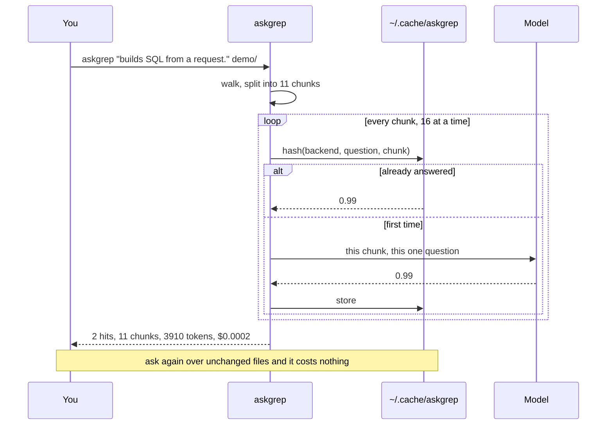

# askgrep

grep for the questions you cannot write as a pattern.


```console
$ askgrep "builds SQL by concatenating a value that came from a request" src/
db/orders.rs:412   0.94  fn search_orders(q: &Query) -> Vec<Order> {
api/admin.rs:88    0.91  pub fn lookup_by_email(email: &str) -> Option<User> {

2 hits in 1,866 chunks  |  0 cached  |  665,214 tokens  |  $0.0279
```

You already know how to find `.unwrap()`. You do not know how to write the regex
for "retries without backoff", so today you guess a few patterns and hope.

## It reads everything, not a sample

This is the part that matters. Tools built on an LLM have to sample, because
reading every function costs real money, so they pick a few files by embedding
similarity and answer from those. When the thing you were looking for sits in a
file that did not get picked, the answer is "nothing found" and you never learn
otherwise.

askgrep asks about every chunk. A full sweep of a 1,866 function codebase costs
under three cents, so there is no reason to sample. Complete beats probably
complete when the question is a security one.

## Install

```sh
cargo install askgrep
export TYPESAFE_API_KEY=...   # https://typesafe.ai
```

`--dry-run` counts the chunks and prices the sweep without a key, so you can see
what a run would cost before signing up for anything.

## Backends

askgrep needs one number per chunk, so anything that can produce one will do.

```sh
askgrep "..."                                      # jev, if TYPESAFE_API_KEY is set
askgrep "..." -b openai -m gpt-4o-mini             # any OpenAI-compatible endpoint
askgrep "..." -b openai --base-url http://localhost:11434/v1 -m qwen2.5-coder
```

**jev** returns a calibrated probability directly. It is what the numbers on this
page were measured with.

**openai** asks a chat model for a single token and reads the distribution over
`yes` and `no` at that position, rather than asking it to rate its own confidence
in prose. That is a distribution the model already computed, and it ranks far
better than a self-reported number. An endpoint that serves no logprobs falls back
to the one word it wrote, and scores are then only 0.0 or 1.0, which makes
`--threshold` meaningless. The footer prints no cost for this backend, because
askgrep does not know what your endpoint charges.

Scores from different backends never share a cache.

## Use

```sh
askgrep "catches an error and swallows it without logging or rethrowing"
askgrep "logs an object that could contain a token or a password" src/
askgrep "still uses the old auth middleware instead of requireSession" --threshold 0.9
askgrep "writes to the database inside a loop" --json | jq -r .file
```

Phrase the question as something the code *does*. It is spliced after
"The code in `state` ", so "builds SQL from user input." reads correctly and
"SQL injection" does not.

| flag | |
| --- | --- |
| `-t, --threshold` | report at or above this score, default `0.8` |
| `-j, --jobs` | concurrent requests, default `16` |
| `--dry-run` | count and price, call nothing |
| `--json` | one object per hit |
| `--no-cache` | re-ask every chunk |

Answers are cached on disk by content. Re-running a question over unchanged files
costs nothing, so the loop of sweep, fix, sweep again is free after the first pass.

## One chunk per request, and why

Packing twenty chunks into one request is 1.7x cheaper and much worse. Measured on
120 Rust functions, scored against a regex that answers the same question exactly:

| chunks per request | precision @0.8 | recall @0.5 |
| --- | --- | --- |
| 1 | 0.85 | 1.00 |
| 5 | 0.65 | 0.93 |
| 20 | 0.43 | 0.79 |

So askgrep does not offer the option. Concurrency covers the latency instead: 120
chunks take 10 seconds at 16 jobs, against 135 sequential.

## What it is bad at

**It is not a grep replacement.** If you can write the pattern, write the pattern.
ripgrep is instant and free.

**It judges one function alone.** If the validation lives in the caller, askgrep
will call the callee unsafe. That is why hits carry a score and are sorted by it
rather than presented as a verdict. Read them.

**It costs money.** Roughly three cents per thousand functions. `--dry-run` tells
you before you spend.

**English questions work best.** The model handles other languages, less well.

## How it works



One chunk, one question, one number. Nothing is generated, so the failure mode
is a wrong score, never an invented file or a fabricated line number.

### What one sweep does



## Reproducing the demo

`demo/` holds the three files in the GIF. Two of the five queries in it build SQL
by concatenation and the rest bind parameters, so the sweep has a right answer:

```sh
askgrep "builds an SQL query by concatenating a value that came from the request." demo/
```

`demo.tape` regenerates the GIF with [vhs](https://github.com/charmbracelet/vhs).

## License

Apache-2.0
